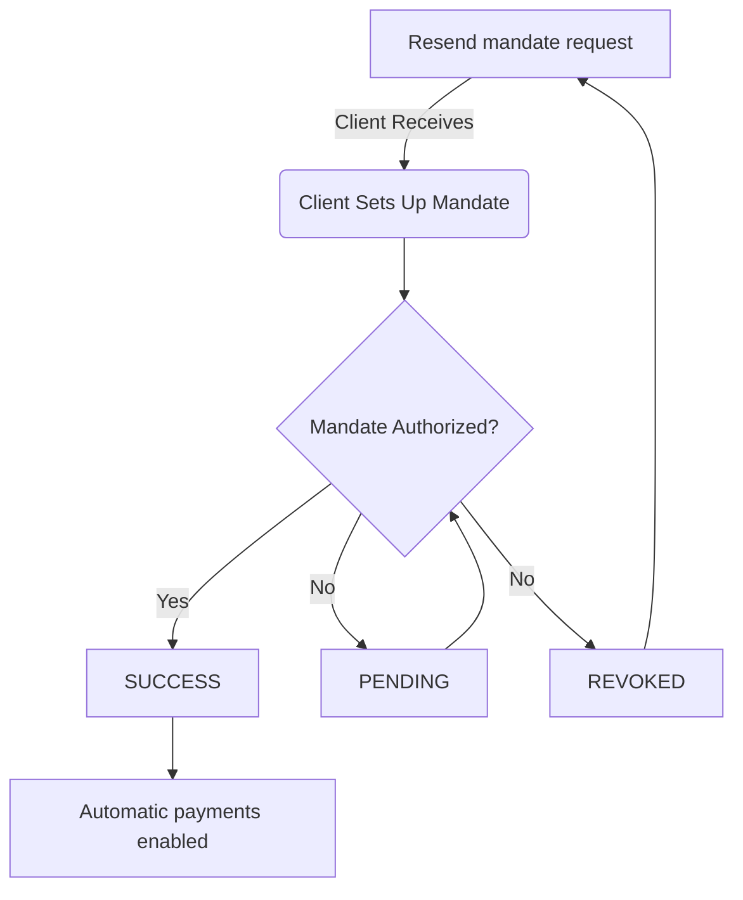

import Mermaid from '@theme/Mermaid';

# Managing Clients

This guide explains how to create and manage clients in Fiskl and helps you maintain organized financial records for invoicing, quotes, and payments.

Clients are the foundation of your business transactions in Fiskl. Every invoice, quote, and financial interaction connects to a client record. By managing clients effectively, you ensure accurate billing, organized financial data, and efficient payment collection.

## Before You Begin

Ensure you have:
- Your company details configured in **Company Settings**
- Client billing requirements (currency preferences, tax information)
- Time rates for clients billed hourly (if applicable)

## Creating a Client

To add a new client to Fiskl:

1. **Open the Clients section**

   In the left menu, select **Clients & Vendors**, then select the **Clients** tab.

2. **Start a new client record**

   Select **New client**.

3. **Search for the client**

   In the client name field, search for your client's name or business name. If found, their details populate automatically.

4. **Add contact information**

   Enter the client's email address. Optionally, add Cc and Bcc addresses for invoice delivery.

5. **Configure the address layout**

   Review and adjust the address format. This exact layout appears on all invoices and quotes for this client.

:::tip
The address layout you configure becomes the default format for all documents sent to this client. Take a moment to ensure it matches your preferred formatting style.
:::

### Setting Client Defaults

Fiskl allows you to set default values that apply automatically when creating invoices or time entries:

- **Default currency**: Select the currency this client prefers for billing
- **Default time rate**: Enter the hourly rate for time-based billing

These defaults save time and ensure consistency across all client transactions.

## Importing Multiple Clients

For bulk client creation, Fiskl accepts CSV file imports:

1. **Access the import function**

   Go to **Clients & Vendors** in the left menu and select **Clients**. Select the **Import** button at the top of the list.

2. **Upload your CSV file**

   Select **Import client details** and choose a CSV file from your device.

3. **Map your data fields**

   Match the CSV column headers with Fiskl field names to ensure data imports correctly.

4. **Review and confirm**

   Preview the client data before importing. After reviewing, select **Import** to add the clients to your database.

After import completes, you receive a notification showing how many clients were added successfully.

:::info
You can import contact lists directly from your device using the Fiskl mobile app for Android or iOS.
:::

## Managing Your Client List

The client list provides a centralized view of all your clients with key information displayed in columns. From this screen, you can create invoices, view client details, and perform bulk actions.

**Available actions:**
- Sort clients by name, creation date, or total billing
- Filter by currency, status, or custom tags
- Access quick actions through the menu next to each client name
- Search for specific clients using the search bar

The client list updates in real-time as you add, edit, or archive clients.

## Direct Debit Mandates

Fiskl integrates with [GoCardless](/integrations/payments/gocardless-integration.md) for automated Direct Debit payments. When you enable this feature, clients can authorize automatic payment collection for recurring invoices.

**Mandate statuses in the client list:**

- **Success**: Mandate authorized and active for automatic payments
- **Pending**: Client has not yet completed authorization
- **Revoked**: Client cancelled the mandate or authorization failed

### How Direct Debit Mandates Work

When you send an invoice with GoCardless enabled, the client receives instructions to set up their mandate. Once authorized, Fiskl collects payments automatically according to your invoice terms.

## Best Practices

Follow these guidelines for effective client management:

- **Keep records current**: Update contact details, tax information, and billing preferences regularly
- **Use client-specific settings**: Configure currencies and time rates for accurate invoicing
- **Archive inactive clients**: Review your client list periodically and archive clients you no longer work with
- **Enable Direct Debit for recurring clients**: Automate payment collection for clients with regular invoicing

Accurate client records streamline your invoicing workflow, reduce payment delays, and improve financial organization.

## Related Topics

- [Creating Invoices](/invoicing/creating-invoices.md) - Learn how to bill clients
- [GoCardless Integration](/integrations/payments/gocardless-integration.md) - Set up automated payments
- [Managing Vendors](./vendors) - Track businesses you pay