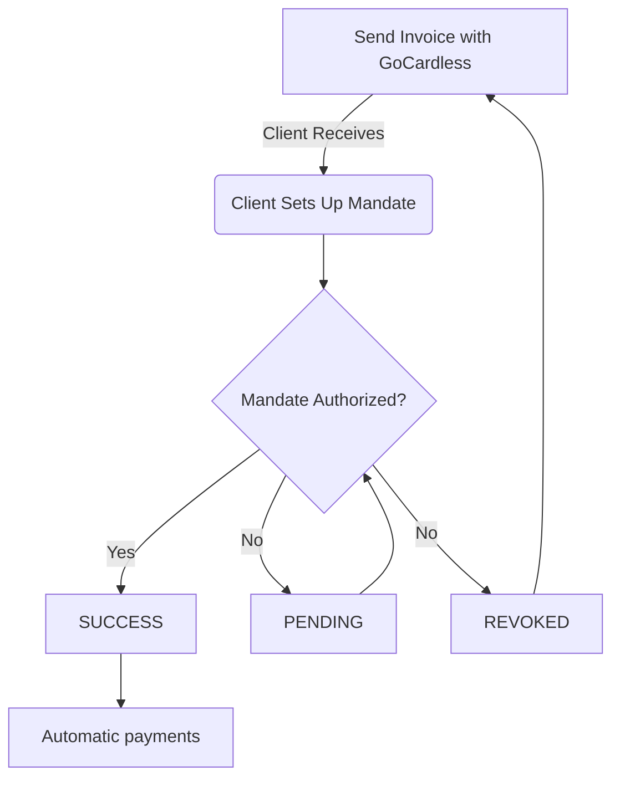

import Mermaid from '@theme/Mermaid';

This guide explains how to add and manage clients in Fiskl and helps you maintain organized records for invoicing, quoting, and financial tracking.

## Before You Begin

Ensure you have:

- Your company details configured in **Settings** > **Company**
- Client billing requirements (currency preferences, tax information)
- Hourly time rates for clients billed by the hour (if applicable)

## Creating a Client

To add a new client:

1. In the left sidebar, select **Clients & Vendors** and select the **Clients** tab
2. Select **New client**
3. In the **Client name** field, enter your client name or business name
4. Select the client from the search results

   Fiskl automatically populates the client details.

5. Enter the client email address
6. Add Cc and Bcc recipients if needed
7. Review and adjust the address format

:::tip
The address format you set here appears exactly as shown on all invoices and quotes for this client.
:::

### Setting Client Defaults

Configure default settings that apply automatically when creating invoices and time entries:

- **Default currency** - The currency used for this client's transactions
- **Default time rate** - The hourly rate applied to time-based billing

These defaults save time but can be adjusted on individual invoices when needed.

## Importing Clients

To import multiple clients from a CSV file:

  
Import clients from CSV

1. In the left sidebar, select **Clients & Vendors** and select the **Clients** tab
2. Select the **Import** button at the top of the client list
3. Select **Import client details**
4. Choose your CSV file from your device
5. Map the CSV column headers to Fiskl field names
6. Select **Import**
7. Review the preview of clients to be imported
8. Select **Import** to confirm

After import completes, Fiskl displays the number of clients added to your list.

:::info
You can import contacts directly using the Fiskl mobile app on Android or iOS.
:::

## Managing Your Client List

The client list displays all your clients with key information at a glance. From this view, you can create invoices, view client details, and access client-specific actions.

Use the search and filter options to find specific clients quickly. Select the menu next to each client name to access additional actions like editing or archiving.

## Direct Debit Mandates

Fiskl supports Direct Debit mandates for automatic payments through [GoCardless](../integrations/payments/gocardless-integration.md). The client list displays each client's mandate status.

### How Direct Debit Mandates Work

When you send an invoice with GoCardless enabled, your client receives a prompt to authorize a Direct Debit mandate. Once authorized, future payments process automatically on the due date.

## Best Practices

Follow these practices for effective client management:

- **Keep information current** - Update contact details and tax information regularly
- **Set client-specific defaults** - Assign appropriate currencies and time rates for accurate invoicing
- **Maintain your client list** - Review regularly and archive inactive clients
- **Enable automatic payments** - Set up direct debit mandates for recurring clients

Effective client management streamlines your invoicing and payment processes, leading to better financial organization.

## Related Topics

- [Creating Invoices](/docs/invoicing/creating-invoices.md) - Bill clients for your products and services
- [Managing Quotes](/docs/invoicing/creating-quotes.md) - Create estimates for potential work
- [GoCardless Integration](/docs/integrations/payments/gocardless-integration.md) - Set up automatic payment collection