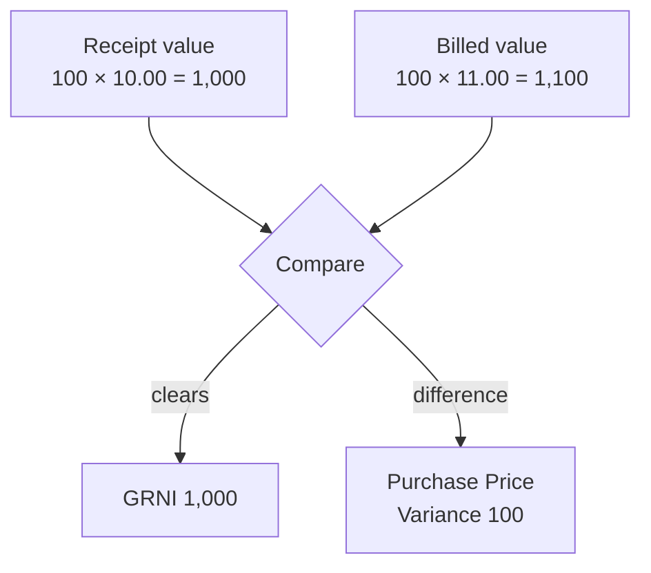

This guide explains how to enter a vendor's bill against goods you have received, and what happens when the vendor charges a different price from the one on your order. That difference is the purchase price variance, and Fiskl handles it automatically.

## Before You Begin

Post the goods receipt first. Matching a bill to a receipt is what clears **Goods Received Not Invoiced** and reveals any price difference. You can enter a bill before the goods arrive, but the price check is deferred until they do.

## Entering a Bill for Received Goods

Go to **Inventory** > **Bills** and select **New bill**. Enter the vendor, then add the goods.

1. **Enter the bill details**

   Set the vendor, the **Supplier reference** — the vendor's own invoice number, which must be unique for that vendor — and the bill and due dates.

2. **Add the received goods**

   Select **Bill received goods**. A picker opens with two tabs.

   The **Received** tab lists goods receipt lines waiting to be billed, showing the receipt, order, date, product, unbilled quantity and receipt price. Tick the lines this bill covers.

   The **Not yet received** tab lists open order lines where the goods have not arrived. You can bill these, and Fiskl runs the price check when the goods turn up.

3. **Enter what the vendor actually charged**

   Each added line has a **Quantity** and a **Supplier price**. The supplier price is pre-filled from the receipt. Change it to whatever the vendor's invoice says. Any difference posts to purchase price variance automatically.

4. **Add any other lines**

   Use **Add expense line** for anything not received into stock, such as a service charge.

5. **Post the bill**

   Select **Post bill**.

Once the first line is matched, the bill's currency locks to the currency of the matched order. You cannot bill goods ordered in one currency on a bill in another.

## What Posting a Bill Does

| | Account | Amount |
|---|---|---|
| Dr | **Goods Received Not Invoiced** | The matched **receipt** value |
| Dr or Cr | **Purchase Price Variance** | The difference, signed |
| Dr | **Input Tax Receivable** | Recoverable tax |
| Dr | *The account on each expense line* | Non-inventory lines |
| Cr | **Accounts Payable** | The total |

Notice that GRNI is debited at the **receipt** value, not the billed value. That is what lets it clear cleanly to zero. The difference between the two goes to purchase price variance instead.

The bill does not change your stock. Quantities and costs were fixed when the receipt posted, and stock value never moves because of a bill.

## How Purchase Price Variance Is Calculated

The formula is:

> **Variance = what the vendor billed − what you received the goods at**

Both figures are for the matched quantity.

- A **positive** variance is **unfavourable**. You were billed more than you received the goods at, so your costs are higher than expected.
- A **negative** variance is **favourable**. You were billed less.

Fiskl posts the variance the moment you post the bill. There is no approval queue and nothing to review before the bill goes through — the variance is reported afterwards, not used as a block.

## A Worked Example

You order 100 units at 10.00 each. All 100 arrive. The vendor's invoice then charges 11.00 a unit.

**When you receive the goods**, stock rises by 100 units at 10.00:

| | Account | Amount |
|---|---|---|
| Dr | Inventory | 1,000.00 |
| Cr | Goods Received Not Invoiced | 1,000.00 |

**When you post the bill** at 11.00 a unit, the variance is 1,100.00 − 1,000.00 = **100.00 unfavourable**:

| | Account | Amount |
|---|---|---|
| Dr | Goods Received Not Invoiced | 1,000.00 |
| Dr | Purchase Price Variance | 100.00 |
| Cr | Accounts Payable | 1,100.00 |

GRNI is now zero. The receipt is fully billed.

**When you sell 10 units**, they cost what you received them at, 10.00 each:

| | Account | Amount |
|---|---|---|
| Dr | Cost of Goods Sold | 100.00 |
| Cr | Inventory | 100.00 |

**When you pay the bill**, it is an ordinary payment:

| | Account | Amount |
|---|---|---|
| Dr | Accounts Payable | 1,100.00 |
| Cr | Your bank account | 1,100.00 |

Your remaining 90 units are still valued at 10.00 each, so 900.00 of stock. The extra 1.00 a unit you were charged sits in **Purchase Price Variance** as a cost of buying, not as part of stock value. That is the whole point of the variance account: it keeps your stock valued at a consistent cost while still recording what you actually paid.

## Where the Variance Comes From

## How Tax Affects the Variance

Tax is handled differently at receipt and at bill, and the reason is worth understanding because it surprises people.

**Recoverable tax** never touches stock value or variance. It goes to **Input Tax Receivable** at both stages, ready to reclaim.

**Non-recoverable tax** is part of what the goods cost you, so at **receipt** it is capitalised into the landed cost and becomes part of your stock value. By the time the **bill** arrives, the goods are already on the shelf at that cost and stock value cannot be restated. So any non-recoverable tax the bill carries goes to **Purchase Price Variance** instead.

In practice this balances out. Fiskl estimates the tax at receipt from the order, so if the bill's non-recoverable tax matches that estimate, the two offset and the variance is zero. Only the difference shows up.

## Billing Before the Goods Arrive

Sometimes the invoice beats the delivery. Use the **Not yet received** tab to bill an open order line.

Fiskl debits GRNI at the billed value, which puts it temporarily into a debit balance — you have paid for goods you do not yet hold. No variance is recorded, because there is nothing to compare against.

When the goods arrive and the receipt posts, Fiskl compares the two, posts any variance, and settles GRNI. The variance is dated at the goods receipt.

## Paying the Bill

Paying is an ordinary accounts payable settlement. It debits **Accounts Payable** and credits your bank account, and touches no inventory account at all.

This is why the bill matters even when you pay immediately. A receipt leaves a credit in GRNI, and a payment is a credit to your bank. Without a bill in between, the two never meet: GRNI keeps its balance and your inventory looks overstated. If you settle a vendor directly from a bank transaction, Fiskl generates the bill for you behind the scenes for exactly this reason.

## Common Issues

Nothing appears in the "Bill received goods" picker

The picker shows unbilled goods for the vendor on the bill. If it is empty, check the vendor is correct and that the goods receipt has been **posted** rather than left as a draft. Also check the lines are not already billed on another bill.

Lines already added to the bill you are editing are hidden from the picker.

Some rows in the picker are greyed out and cannot be selected

Those rows are in a different currency from the bill. Once you match the first line, the bill's currency locks to that order's currency, and goods from orders in other currencies cannot be added.

Enter a separate bill for the other currency.

My variance looks wrong — it includes tax

Check whether the tax on the bill line is marked recoverable. Non-recoverable tax on a bill goes to purchase price variance by design, because the goods are already valued at their receipt cost and stock value cannot be restated.

If the tax should be reclaimable, mark the line as recoverable tax and it moves to **Input Tax Receivable** instead.

I entered the bill as an expense instead of matching it to the receipt

Your costs are now recorded twice — once in stock value from the receipt, and once as an expense from the bill — and GRNI still holds a balance.

Amend the bill: remove the expense line and add the goods with **Bill received goods** so the lines match the receipt.

The quantity I want to bill is rejected

You cannot bill more than the unbilled quantity on a receipt line. The picker shows the unbilled figure for each line.

If the vendor billed more than arrived, bill the received quantity and take the rest up with them. If the extra goods are on their way, receive them first.

## Related Topics

- [Purchase Orders and Receiving](/inventory/purchase-orders-and-receiving) — order goods and record what arrives.
- [Inventory Reports](/inventory/inventory-reports) — review every variance in one place.
- [Setting Up Inventory](/inventory/setting-up-inventory) — the accounts these journals post to.
- [Vendors](/clients-vendors/vendors) — manage the vendors you buy from.
