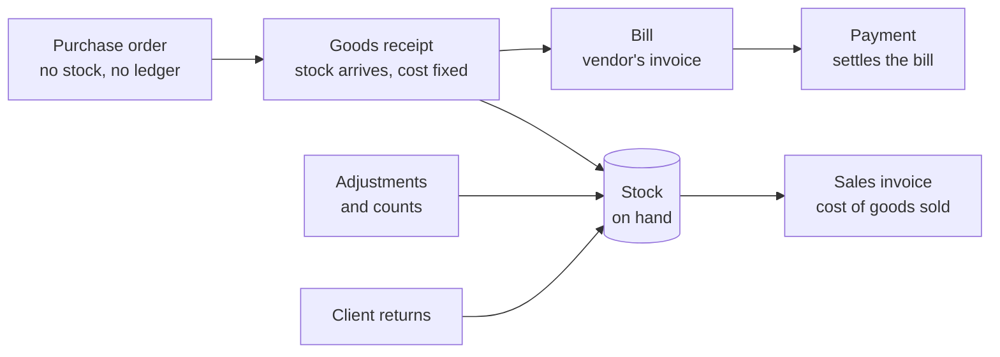

import DocCardList from '@theme/DocCardList';

This guide explains how inventory works in Fiskl: what stock tracking gives you, which documents move stock, and how every movement posts to your general ledger without manual journals. Read this page first to understand the shape of the system, then follow the individual guides for each step.

## What Inventory Does

Inventory tracking turns a product in your catalog into a stock item with a quantity, a cost, and a full movement history. Once a product is tracked, Fiskl records every change in stock and posts the matching accounting entries for you.

You get four things:

- **Quantities on hand** — how much you hold, updated as goods arrive and orders ship.
- **Stock cost** — what your stock is worth, calculated using weighted average or FIFO.
- **Automatic cost of sales** — when you invoice a tracked product, Fiskl moves its cost from your inventory asset to cost of goods sold.
- **An audit trail** — every movement is permanent and linked to the journal it posted.

Inventory is designed for businesses that buy and resell physical goods. If you sell services, or you buy goods you consume rather than resell, you do not need it.

## Tracked and Not Tracked Items

Every inventory item is one of two kinds, set when you start tracking a product:

- **Tracked** — the item takes part in the stock ledger. It records movements, posts inventory and cost of goods sold entries, and appears in the Stock Valuation report.
- **Not tracked** — the item exists only to hold reference details such as a SKU, a unit and a reorder point. It never records a stock movement and never posts to your ledger.

Select **Tracked** unless you specifically want the reference details without the accounting.

## The Documents That Move Stock

Inventory runs on four purchasing documents plus your existing invoices. Each has a distinct job, and the order matters.

A **purchase order** records what you have ordered. It has no effect on your stock or your accounts, so you can raise and send one freely.

A **goods receipt** records what physically arrived. This is the moment stock increases and its cost is fixed. You create it from inside the purchase order.

A **bill** records the vendor's invoice. It moves the liability into accounts payable and reveals any difference between the price you expected and the price you were charged.

A **payment** settles the bill in the ordinary way. It does not touch any inventory account.

Selling is separate. When you send an invoice containing a tracked product, Fiskl relieves the stock and posts its cost to cost of goods sold.

## What Moves Stock and What Only Posts to the Ledger

Not every step does both. This table is worth remembering, because it explains why a purchase order shows nothing on your balance sheet and why paying a bill never changes your stock value.

| Event | Changes stock | Posts a journal |
|---|---|---|
| Raise or send a purchase order | No | No |
| Post a goods receipt | Yes | Yes |
| Post a bill | No | Yes |
| Pay a bill | No | Yes, but no inventory account |
| Send an invoice with a tracked product | Yes | Yes |
| Revert or void that invoice | Yes | Yes |
| Client return, restocked | Yes | Yes |
| Client return, written off | No | Yes |
| Stock adjustment or count | Yes | Yes |
| Void a goods receipt | Yes | Yes |

## A Complete Example

The clearest way to see the flow is with numbers. Suppose you order 100 units at 10.00 each, and the vendor bills you at 11.00.

1. **Raise the purchase order** for 100 units at 10.00. Nothing posts.
2. **Receive all 100 units.** Stock rises by 100 at 10.00 each. Fiskl debits **Inventory** 1,000.00 and credits **Goods Received Not Invoiced** 1,000.00.
3. **Enter the bill** at 11.00 a unit. Fiskl debits **Goods Received Not Invoiced** 1,000.00 to clear it, debits **Purchase Price Variance** 100.00 for the difference, and credits **Accounts Payable** 1,100.00.
4. **Sell 10 units.** Fiskl debits **Cost of Goods Sold** 100.00 and credits **Inventory** 100.00, at the 10.00 receipt cost.
5. **Pay the bill.** Fiskl debits **Accounts Payable** and credits your bank account. No inventory account moves.

Your stock stays valued at the 10.00 you received it at. The extra 1.00 a unit is a cost of buying, not part of stock value, which is why it lands in **Purchase Price Variance**. The full walkthrough is in [Bills and Purchase Price Variance](/inventory/bills-and-price-variance).

## Before You Begin

Set your valuation method before you receive any stock. It determines how every future sale is costed, and changing it later does not restate the history you already have. See [Setting Up Inventory](/inventory/setting-up-inventory).

You also need the products themselves. Inventory tracks items from your product catalog, and only products, not services. See [Creating Products](/products-services/creating-products).

## In This Section

<DocCardList />

## Related Topics

- [Setting Up Inventory](/inventory/setting-up-inventory) — set your valuation method and understand the accounts Fiskl creates.
- [Tracking Products](/inventory/tracking-products) — turn a product into a stock item and set reorder points.
- [Purchase Orders and Receiving](/inventory/purchase-orders-and-receiving) — order from vendors and record what arrives.
- [Chart of Accounts](/accounting/chart-of-accounts) — where the inventory system accounts sit in your ledger.
