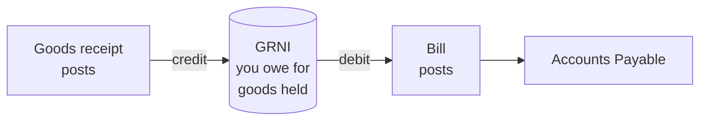

import TOCInline from '@theme/TOCInline';

This guide explains how to order stock from a vendor and record what arrives. Receiving is the most important step in inventory, because it is where stock increases and where its cost is fixed for good.

<TOCInline toc={toc} minHeadingLevel={2} maxHeadingLevel={2} />

## Before You Begin

Set up the vendor and the products you are ordering. Every product on a receivable line must already be tracked as an inventory item, and Fiskl checks this when you send the order.

Purchase orders and goods receipts have separate permissions, so you may be able to raise an order but not receive against it, or receive goods but not post the receipt.

Raising and editing an order needs `purchase_order.write`; emailing it to the vendor needs `purchase_order.send`. Downloading the PDF needs only `purchase_order.read`, so someone can print or file an order without being able to contact vendors.

Recording what arrived needs `goods_receipt.write`, but `goods_receipt.post` is what actually moves stock and posts to your ledger. Voiding a posted receipt also needs `goods_receipt.post`, since it reverses those postings. See the [Permissions Reference](/team/permissions-reference).

## Raising a Purchase Order

Go to **Inventory** > **Purchase Orders** and select **New purchase order**. Enter the vendor, the dates, and a line for each product with its quantity and price.

Lines come in two kinds:

- **Inventory** lines are goods you will receive into stock.
- **Expense** lines are costs such as services that you will be billed for but never take delivery of.

Only inventory lines can be received.

An order moves through six statuses:

| Status | Meaning |
|---|---|
| **Draft** | Being prepared. The only status you can edit. |
| **Sent** | Issued to the vendor. |
| **Partially received** | Some goods have arrived. |
| **Received** | Every receivable line is fully received. |
| **Closed** | Fully received **and** fully billed. |
| **Cancelled** | Abandoned. |

:::info
A purchase order has no effect on your stock or your accounts in either **Draft** or **Sent**. Nothing appears on your balance sheet until you post a goods receipt, so you can raise and send orders freely.
:::

Only draft orders can be edited. Once an order is sent, change it by cancelling it and raising a new one.

## Recording What Arrives

Open the purchase order and find the **Goods receipts** card. Select **Receive goods**.

1. **Set the received date**

   Defaults to today. This date drives which accounting period the stock lands in.

2. **Check the quantities**

   Each line is pre-filled with the full outstanding quantity. Lower it to record a partial delivery, or clear it to leave that line out entirely.

3. **Check the prices**

   Each line is pre-filled with the price from the order. This is the baseline Fiskl compares against when the vendor's bill arrives, so leave it at the order price unless you know it was wrong.

4. **Add any charges**

   Use the **Charges** card for freight, duty or handling. See below.

5. **Post the receipt**

   Save it, then post it. Posting is what moves the stock.

You cannot receive more than the outstanding quantity. Receiving again against the same order creates a second receipt, and the order moves to **Partially received** and then **Received** as you go.

## Adding Freight, Duty and Handling

Costs that arrive with your goods belong in the value of those goods, not in a separate expense. Open the **Charges (freight, duty, handling)** card and select **Add charge**.

For each charge, set the **Type** (Freight, Duty, Handling or Other), a description, and the amount. Then set how to spread it with **Allocate by**:

- **Line value** — spreads in proportion to what each line is worth. Use this for freight priced on value, and for duty.
- **Quantity** — spreads evenly per unit. Use this for handling or shipping priced per item.

Leave **Charged by** blank if the order's vendor is charging you, or set a different vendor when a third party invoices the freight.

Fiskl allocates charges so the parts always add back to the total exactly, with no rounding leftover.

## What Posting a Receipt Does

Posting a goods receipt increases your stock and posts this journal:

| | Account | Amount |
|---|---|---|
| Dr | **Inventory** | Quantity multiplied by landed unit cost |
| Dr | **Input Tax Receivable** | Recoverable tax only |
| Cr | **Goods Received Not Invoiced** | The total of the above |

The **landed unit cost** is what the goods really cost to get onto your shelf:

- The price on the receipt line, multiplied by the quantity
- Plus the share of any freight, duty or handling allocated to that line
- Plus any **non-recoverable** tax

Recoverable tax is different. It goes to **Input Tax Receivable** to be reclaimed, and never becomes part of your stock value.

If you order in one unit and stock in another, the conversion happens here, once. A case of 12 received as 1 case becomes 12 units in stock. There is no conversion on the sales side, so invoice in your stocking unit.

:::warning
Posting a receipt fixes the cost of that stock permanently. A posted receipt cannot be edited — the only way to correct it is to void it and create a new one, and voiding is blocked once the goods have been billed or sold. Check your quantities and prices before you post.
:::

## Understanding GRNI

**Goods Received Not Invoiced** is the account that makes receiving before billing possible. It is a liability, and it holds the value of goods sitting on your shelf that the vendor has not yet billed you for.

The cycle is straightforward:

- A **goods receipt** credits GRNI. You have the goods, so you owe someone for them.
- A **bill** debits GRNI and moves the liability to accounts payable, where it can be paid.
- Once a receipt is fully billed, its GRNI balance is **zero**.

If you bill only part of a receipt, the rest stays in GRNI until the remaining quantity is billed. Fiskl makes the final portion absorb any rounding, so a fully billed line always clears GRNI to the cent.

A standing balance in GRNI means goods you have received but not yet entered a bill for. That is normal in the gap between delivery and invoice. A balance that never clears usually means a missing bill, or a bill entered as a plain expense rather than matched to the receipt.

## Voiding a Receipt

Open the purchase order, find the receipt in the **Goods receipts** card, and select the void action. Fiskl reverses both the stock and the journal, and rolls the order's progress back.

Two things block a void:

- **Anything billed against the receipt.** Delete or amend the bill first.
- **Stock that has already moved.** The received goods must still be untouched. Under FIFO the batch the receipt created must be completely intact.

The reversing journal is dated **today**, not the original receipt date. If the original receipt was in a closed period, the reversal correctly lands in the open one.

## Common Issues

I cannot send my purchase order — it says a product is not tracked

Every product on a receivable line has to exist as a tracked inventory item before the order can be sent. Fiskl checks at send time so the problem surfaces before the goods arrive.

Go to **Inventory** > **Items**, select **Track a product**, and set the product up. Then send the order again.

I received the wrong quantity and the receipt is already posted

Posted receipts cannot be edited. Void the receipt and create a new one with the correct quantity.

If you cannot void it because the goods have been billed, amend or delete the bill first. If the stock has already been sold, use a stock adjustment to correct the quantity instead.

I cannot void a receipt — it says the stock has been consumed

Some or all of the received goods have already been sold, adjusted or otherwise moved. Voiding would take your stock negative, so it is blocked.

Correct the quantity with a stock adjustment instead. Under FIFO the check is stricter: the batch created by the receipt must be entirely untouched, even if you have enough total stock from other receipts.

My GRNI balance is not clearing

GRNI clears when you enter the vendor's bill and match it to the goods receipt. Two things commonly leave a balance behind.

The bill may not have been entered yet, which is normal and clears itself. Or the bill may have been entered as an ordinary expense rather than matched to the receipt lines. GRNI then keeps the balance and your costs are recorded twice. Amend the bill and add the lines using **Bill received goods**.

## Related Topics

- [Bills and Purchase Price Variance](/inventory/bills-and-price-variance) — enter the vendor's bill and clear GRNI.
- [Tracking Products](/inventory/tracking-products) — set products up before ordering.
- [Vendors](/clients-vendors/vendors) — manage the vendors you buy from.
- [Inventory Reports](/inventory/inventory-reports) — confirm your stock value ties to your balance sheet.
