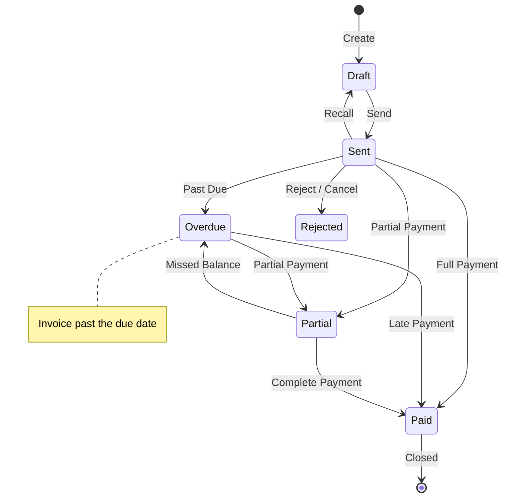

import TOCInline from '@theme/TOCInline';

This guide explains how to create invoices in Fiskl and helps you bill clients professionally from your first invoice to advanced configurations.

<TOCInline toc={toc} minHeadingLevel={2} maxHeadingLevel={2} />

---

## Before You Begin

Three things must be in place before you can create a complete, sendable invoice:

1. **Company Settings are complete** — Your company name and address appear on every invoice. Go to **Settings** > **Company Settings** and confirm your details are correct.
2. **A client exists** — Every invoice requires a client. You can create one during invoice creation, but having clients set up in advance is faster. See [Managing Clients](/docs/clients-vendors/clients).
3. **A payment method is set up** — Without this, your client cannot pay online. Set up an integrated gateway like **Stripe** or a manual payment method in **Settings** > **Payment Methods**.

:::warning
If your company address is incomplete, it will appear incorrectly on all invoices. Fix this in **Company Settings** before creating your first invoice.
:::

---

## Create a Basic Invoice

1. **Open Invoices**

   In the left sidebar, select **Invoices**.

2. **Select New Invoice**

   Select the **+ New Invoice** button in the top right corner.

3. **Select or add a client**

   Choose an existing client from the **Client** dropdown, or select **Add Client** to create one now.

4. **Set the invoice date and due date**

   The invoice date defaults to today. The due date defaults to seven days after the invoice date. You can change both.

5. **Add line items**

   Select **Add Line Item** and choose the type: **Product**, **Service**, **Expense**, **Mileage**, or **Time**. Enter the description, quantity, and rate for each item.

6. **Apply tax if required**

   Select the tax rate for each line item using the tax field. Fiskl calculates the total automatically.

7. **Review the total**

   Check the subtotal, tax, and total amount at the bottom of the invoice.

8. **Save or send**

   Select **Save** to keep the invoice as a draft, or select **Send** to email it to your client immediately.

:::tip
Use the interactive demo to walk through invoice creation step by step: [Launch demo](https://demo.fiskl.com/e/clzctmgxx008yl30czzc6urmn/tour)
:::

---

## Invoice Components

This section explains every part of an invoice and how to configure each one.

### Company Information

Fiskl pulls three fields from your **Company Settings** onto every invoice:

- Company name
- Company address
- Company ID or registration number

To change how your address is formatted on invoices, go to **Settings** > **Company Settings** and update the address layout.

### Client Details

The invoice uses the following fields from the client profile:

- Client name
- Client address
- Client email (including CC and BCC addresses)
- Tax/VAT registration number (displayed automatically if set on the client)
- Default currency and time rate

You can add a client directly during invoice creation. For recurring clients, set up their profile in advance to save time.

### Invoice Number

Invoice numbers start at INV-0001 and increment automatically with each new invoice.

**Customising the format:**

To use a different format, edit the invoice number on any new invoice. Fiskl uses that format for all subsequent invoices.

Two limitations apply:
- Auto-increment only works if the number ends with a digit
- Date-based formats (e.g., `2025-01-0001`) require manual updates at each period change

### Invoice Dates

Every invoice has three date fields:

| Field | Purpose | Default |
|---|---|---|
| Invoice date | The date the invoice was created | Today |
| Due date | The payment deadline | Seven days after invoice date |
| Sales date | Optional — records when the sale occurred | Empty |

To change the default due date period, go to **Settings** > **Invoice & Quote Settings**.

### Invoice Status

Fiskl updates invoice status automatically based on the due date and payments received.

### Line Items

Line items are the billable rows on your invoice. Fiskl supports five types:

| Type | Description |
|---|---|
| **Product** | A physical or digital item. Products are reusable templates. |
| **Service** | A service you provide. Services are reusable templates. |
| **Expense** | A business expense you are billing to the client. |
| **Mileage** | Travel distance billed at a per-kilometre or per-mile rate. |
| **Time** | Billable hours tracked against the invoice. |

You can create line items directly on the invoice, or set up Products and Services in advance under **Line Items** in the left sidebar.

### Tax and VAT

Apply tax at the line item level. Fiskl supports single taxes, multiple taxes, and compound taxes per item.

To switch between tax-inclusive and tax-exclusive pricing, select the **+/-** button next to the tax field on any line item.

**If your tax number is not showing on the invoice**, check both of these:

1. Go to **Settings** > **Tax Settings** and confirm the **Display tax number on invoices** checkbox is selected.
2. Go to **Settings** > **Templates & Brands** and confirm the **Hide tax number** checkbox is not selected.

Your tax number appears automatically when at least one line item has tax applied.

### Discounts and Deposits

Apply discounts or request deposits at the invoice level, not per line item.

- **Fixed amount**: Enter the number only — for example, `100` for a $100 discount
- **Percentage**: Add a `%` sign — for example, `15%` for a 15% discount

Deposits work the same way and appear as a line on the invoice total.

### Currency

The invoice currency defaults to your company's base currency, unless the selected client has a different default currency set on their profile.

To change the currency for an individual invoice, select the currency name next to the invoice total and choose a different currency.

:::info
When line items are in a different currency from the invoice, you can adjust the exchange rate manually for each item.
:::

### Invoice Language

Fiskl supports over 60 languages. The selected language affects the invoice itself, standard email templates, and all customer-facing screens.

To set a default language for all invoices, go to **Settings** > **Invoice & Quote Settings**.

### Styling and Templates

Customise the invoice appearance — logo, colours, fonts, and layout — in **Settings** > **Templates & Brands**.

:::warning
Changes to a template apply to all invoices using that template, including already-sent invoices viewed by clients.
:::

### Additional Fields

**PO Number and custom fields**: Add a purchase order number or other reference fields in the **Additional Information** section of the invoice.

**Notes**: Include a custom note on each invoice, or set a default note for all invoices in **Settings** > **Invoice & Quote Settings**.

**Payment Terms**: The due date calculates automatically based on the payment terms set in **Settings** > **Invoice & Quote Settings**.

### Payment Schedules

Split a single invoice into two to twelve instalments using payment schedules.

Each instalment can be a fixed amount or a percentage of the total. Fiskl tracks each instalment's payment status separately.

:::tip
Use payment schedules for short-term instalment billing. For long-term or indefinitely recurring billing, use [Recurring Invoices](/docs/invoicing/recurring-invoice-management) instead.
:::

---

## Common Issues

My tax number is not showing on the invoice

Two settings control tax number visibility. Check both:

1. Go to **Settings** > **Tax Settings** and confirm the **Display tax number on invoices** checkbox is selected.
2. Go to **Settings** > **Templates & Brands** and confirm the **Hide tax number** option is not selected.

Your tax number only appears if at least one line item on the invoice has tax applied.

The invoice currency is wrong

The currency defaults to your company base currency, or the client's default currency if one is set. To change it for an individual invoice, select the currency name next to the total amount and choose the correct currency.

To change the client's default currency, go to **Clients**, select the client, and update their currency setting.

My client cannot pay online

Online payment requires an active payment gateway. Go to **Settings** > **Payment Methods** and confirm that Stripe or another gateway is connected and active. If no payment method is set up, your client will see the invoice but will not have a payment button.

The invoice number is out of sequence

If you edited an invoice number manually, Fiskl uses that as the new base for auto-increment. Create a new invoice and manually set the number to the correct value. All subsequent invoices will increment from that point.

Template changes affected invoices I already sent

Template changes apply globally to all invoices using that template. If you need to change styling without affecting existing invoices, create a new template in **Settings** > **Templates & Brands** and apply it only to new invoices going forward.

---

## Related Topics

- [Invoice Management](/docs/invoicing/invoice-management) — Edit, duplicate, void, and archive invoices
- [Sending Invoices](/docs/invoicing/sending-invoices) — Email options, reminders, and client view
- [Recurring Invoices](/docs/invoicing/recurring-invoice-management) — Automate regular billing
- [Tax Settings](/docs/settings/tax-settings) — Configure tax rates and display options
- [Managing Clients](/docs/clients-vendors/clients) — Set up client profiles and defaults
- [Payment Gateways](/docs/integrations/payments/overview) — Connect Stripe and other payment methods